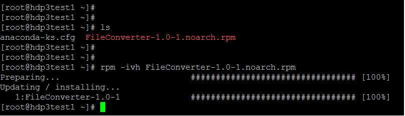

# Fixed File Format Converter

**Fixed-File-Format-Converter** is a Java based a generic tool to convert fixed file format files to a csv file based on a metadata file describing its structure.

Structure of metadata file is in csv format with a line for each column.
* column name
* column length
* column type --- | defined-types |

defined-types : date (format yyyy-mm-dd) or numeric (decimal separator '.' ; can be negative) or string

Fixed file format files can have any number of columns.

The generated csv file should have Header for column names and date types should be reformatted to dd/mm/yyyy format. Additionally, the values in the csv should be trimmed. The string type may contain separator characters like ',' and then the whole string needs to be escaped with " (double quotes).

## Example

Data file:
```
1970-01-01John           Smith           81.5
1975-01-31Jane           Doe             61.1
1988-11-28Bob            Big            102.4
```

Metadata file:
```
Birth date,10,date
First name,15,string
Last name,15,string
Weight,5,numeric
```

Output file:
```
Birth date,First name,Last name,Weight
01/01/1970,John,Smith,81.5
31/01/1975,Jane,Doe,61.1
28/11/1988,Bob,Big,102.4
```

## Approach
The tool validates the metadata and then reads the fixed file and convert to csv file. If there is any validation error in the fixed file, then the line that have issues is logged in logs with proper rejection details. The tool inserts the processed data in a batch ot 10K records to csv to reduce the memory footprint and to process large file.

## Technology Stack
* Java 7
* Maven
* JUnit
* RPM

## Usage Instructions
1. Build using maven 
    ```mvn clean package```

	Build will compile, test and generate the RPM and final RPM is copied to [RPM Directory](RPM/FileConverter-1.0-1.noarch.rpm)
	
2. Install RPM
Click here to download the [RPM](https://github.com/AnalyticsApps/Converter/raw/master/RPM/FileConverter-1.0-1.noarch.rpm)
    ```
    rpm -ivh FileConverter-1.0-1.noarch.rpm
    
    ```
    
    
3. Running the script

Application will be available under /opt/FileConverter

    ```
[root@testeserver ~]#
[root@testeserver ~]# cd /opt/FileConverter/
[root@testeserver FileConverter]#

[root@testeserver FileConverter]# ls
bin  conf  lib  log  Readme.txt  sample
[root@testeserver FileConverter]#

[root@testeserver FileConverter]# bin/Converter

 Path to metadata file: /opt/FileConverter/sample/metadata.txt

 Path to data file: /opt/FileConverter/sample/input.txt

 Path to Out file: /opt/inputCSV.txt

 File conversion completed.

[root@hdp3test1 FileConverter]#

    ```
    

4. Uninstalling RPM
    ```
    rpm -e FileConverter-1.0-1.noarch
    
    ```
    
